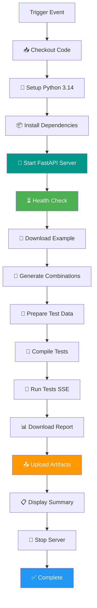

# GitHub Actions Workflow Architecture

## 🎯 Overview

TestForge provides 6 GitHub Actions workflows for comprehensive CI/CD integration:

```
┌─────────────────────────────────────────────────────────────────────┐
│                         GITHUB ACTIONS                              │
├─────────────────────────────────────────────────────────────────────┤
│                                                                     │
│  ┌───────────────────────────────────────────────────────────┐    │
│  │  🎯 Main Workflow: api-integration-test.yml               │    │
│  │  ┌─────────────────────────────────────────────────────┐  │    │
│  │  │  1️⃣ Download Example Template                       │  │    │
│  │  │  ↓                                                  │  │    │
│  │  │  2️⃣ Generate Test Combinations                     │  │    │
│  │  │  ↓                                                  │  │    │
│  │  │  3️⃣ Compile to Robot Framework                     │  │    │
│  │  │  ↓                                                  │  │    │
│  │  │  4️⃣ Run Tests (SSE Stream)                         │  │    │
│  │  │  ↓                                                  │  │    │
│  │  │  5️⃣ Download Test Reports                          │  │    │
│  │  │  ↓                                                  │  │    │
│  │  │  📦 Upload Artifacts                                │  │    │
│  │  └─────────────────────────────────────────────────────┘  │    │
│  └───────────────────────────────────────────────────────────┘    │
│                                                                     │
│  ┌──────────────┐  ┌──────────────┐  ┌──────────────┐            │
│  │ 1️⃣ Download   │  │ 2️⃣ Generate  │  │ 3️⃣ Compile   │            │
│  │   Example    │  │   Combos     │  │   Tests      │            │
│  └──────────────┘  └──────────────┘  └──────────────┘            │
│                                                                     │
│  ┌──────────────┐  ┌──────────────┐  ┌──────────────┐            │
│  │ 4️⃣ Run        │  │ 5️⃣ Download  │  │ 🔄 Run        │            │
│  │   Stream     │  │   Report     │  │   Existing   │            │
│  └──────────────┘  └──────────────┘  └──────────────┘            │
│                                                                     │
└─────────────────────────────────────────────────────────────────────┘
```

---

## 🔄 Workflow Details

### **Main Integration Test** (`api-integration-test.yml`)

**Triggers:**
- 🟢 Manual (workflow_dispatch)
- 🟢 Push to `master` (app/** changes)
- 🟢 Pull Request to `master`

**Flow:**


---

### **Individual Actions** (Standalone Workflows)

Each action can be run independently:

#### **1️⃣ Download Example** (`action-1-download-example.yml`)
```
Start → Setup → Start Server → Health Check → Download → Upload Artifact → Stop
```
**Output:** `example-template` (7 days)

---

#### **2️⃣ Generate Combinations** (`action-2-combination.yml`)
```
Start → Setup → Start Server → Health Check → Generate → Upload Artifact → Stop
```
**Input:** `inputFile` (optional)  
**Output:** `test-combinations` (14 days)

---

#### **3️⃣ Compile Tests** (`action-3-compile.yml`)
```
Start → Setup → Start Server → Health Check → Compile → Upload Artifact → Stop
```
**Input:** `testName`, `inputFile`  
**Output:** `compiled-tests-{testName}` (30 days)

---

#### **4️⃣ Run Stream** (`action-4-run-stream.yml`)
```
Start → Setup → Start Server → Health Check → Run SSE → Upload Logs → Stop
```
**Input:** `testName`  
**Output:** `test-stream-output-{testName}` (14 days)

---

#### **5️⃣ Download Report** (`action-5-download-report.yml`)
```
Start → Setup → Start Server → Health Check → Download → Upload Report → Stop
```
**Input:** `testName`, `timestamp` (optional)  
**Output:** `test-report-{testName}` (30 days)

---

#### **🔄 Run Existing** (`run-test.yml`) - Legacy
```
Start → Setup → Install RF → Run Robot → Upload → Stop
```
**Input:** `testName`  
**Direct Robot Framework execution (no API server)**

---

## 📦 Artifact Flow

```
Main Workflow Artifacts:
┌─────────────────────────────────────────────────────┐
│ testforge-reports-{testName}/ (30 days)            │
│ ├── example-combination-data.xlsx                  │
│ ├── combination_output.xlsx                        │
│ ├── filled_testdata.xlsx                           │
│ ├── compile_response.json                          │
│ ├── sse_output.log                                 │
│ ├── {testName}_Report_{timestamp}.zip              │
│ └── server.log                                     │
└─────────────────────────────────────────────────────┘

Individual Action Artifacts:
┌─────────────────────────────────────────────────────┐
│ example-template/ (7 days)                         │
│ └── example-combination-data.xlsx                  │
├─────────────────────────────────────────────────────┤
│ test-combinations/ (14 days)                       │
│ └── combination_output.xlsx                        │
├─────────────────────────────────────────────────────┤
│ compiled-tests-{testName}/ (30 days)               │
│ ├── compile_response.json                          │
│ └── workspace/{testName}/generated/*.robot         │
├─────────────────────────────────────────────────────┤
│ test-stream-output-{testName}/ (14 days)           │
│ ├── sse_output.log                                 │
│ └── server.log                                     │
├─────────────────────────────────────────────────────┤
│ test-report-{testName}/ (30 days)                  │
│ └── {testName}_Report_{timestamp}.zip              │
└─────────────────────────────────────────────────────┘
```

---

## 🔧 Execution Timeline

**Typical Main Workflow Runtime:**

```
0:00 → 0:30   Setup (Checkout, Python, Dependencies)
0:30 → 1:00   Start Server & Health Check
1:00 → 1:15   Download Example Template
1:15 → 2:00   Generate Combinations
2:00 → 2:30   Compile Tests
2:30 → 5:00   Run Tests (varies by test count)
5:00 → 5:30   Download Report
5:30 → 6:00   Upload Artifacts & Cleanup

Total: ~6 minutes (small test suite)
       ~15 minutes (large test suite)
```

**Individual Actions Runtime:**
- Download Example: ~1 min
- Generate Combinations: ~2 min
- Compile Tests: ~2 min
- Run Stream: ~3-10 min (depends on test count)
- Download Report: ~1 min

---

## 🚨 Error Handling

Each workflow includes comprehensive error handling:

```yaml
# Health Check (with timeout)
for i in {1..30}; do
  if curl -s http://localhost:3000/health > /dev/null 2>&1; then
    echo "✅ Server ready!"
    break
  fi
  sleep 2
done

# Always upload artifacts (even on failure)
- uses: actions/upload-artifact@v4
  if: always()

# Always stop server (cleanup)
- name: Stop Server
  if: always()
  run: kill $(cat server.pid) 2>/dev/null || true
```

---

## 📊 Success Criteria

✅ **Health Check:** Server responds within 60s  
✅ **Download:** File exists and size > 0  
✅ **Generate:** Output Excel has valid structure  
✅ **Compile:** `status: "compiled"` in JSON response  
✅ **Run:** SSE stream completes with `done` event  
✅ **Report:** ZIP file downloaded successfully  

---

## 🔍 Debugging

**Check Workflow Logs:**
```bash
gh run view <RUN_ID> --log
```

**Download and Inspect Artifacts:**
```bash
gh run download <RUN_ID>
cd testforge-reports-*/

# Check server logs
cat server.log

# Check SSE output
cat sse_output.log

# Check compilation
cat compile_response.json
```

**Common Issues:**

| Issue | Cause | Solution |
|-------|-------|----------|
| Health check timeout | Server slow start | Increase timeout, check dependencies |
| File not found | Wrong path | Use repo-relative paths |
| Compilation fails | Invalid format | Validate input file structure |
| Tests fail | Bad endpoint | Check API accessibility |
| Report missing | No test run | Verify test execution completed |

---

**For detailed usage instructions, see:** [.github/workflows/README.md](README.md)
