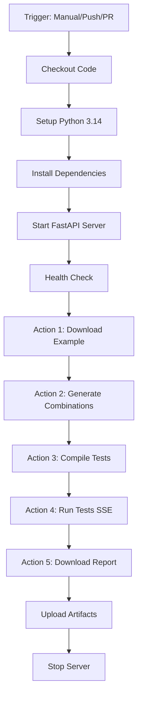

# 🤖 TestForge GitHub Actions Workflows

This document describes all available GitHub Actions workflows for automated testing.

---

## 📋 Available Workflows

### 🎯 **Main Workflow: API Integration Test**
**File:** `.github/workflows/api-integration-test.yml`

**Purpose:** Complete end-to-end test pipeline covering all 5 actions.

**Triggers:**
- ✅ Manual dispatch (workflow_dispatch)
- ✅ Push to `master` branch (when app files change)
- ✅ Pull requests to `master`

**Steps:**
1. 📄 Download example template
2. 🔄 Generate test combinations
3. 🔨 Compile to Robot Framework
4. 🏃 Run tests (SSE streaming)
5. 📊 Download test reports

**Usage:**
```bash
# Via GitHub CLI
gh workflow run api-integration-test.yml \
  -f testName=my-test-suite \
  -f inputFile=data/custom-input.xlsx

# Via GitHub UI
Actions → TestForge API Integration Test → Run workflow
```

**Inputs:**
- `testName` (optional): Test suite name, default: `github-action-test`
- `inputFile` (optional): Path to input CSV/XLSX, default: uses example template

**Artifacts:**
- Example template (`.xlsx`)
- Generated combinations (`.xlsx`)
- Filled test data (`.xlsx`)
- Compilation response (`.json`)
- SSE stream output (`.log`)
- Test reports (`.zip`)
- Server logs (`.log`)

---

### 1️⃣ **Action 1: Download Example Template**
**File:** `.github/workflows/action-1-download-example.yml`

Downloads the example combination data template.

```bash
gh workflow run action-1-download-example.yml
```

**Artifacts:** `example-template` (7 days retention)

---

### 2️⃣ **Action 2: Generate Test Combinations**
**File:** `.github/workflows/action-2-combination.yml`

Generates pairwise/all-pairs test combinations from input file.

```bash
gh workflow run action-2-combination.yml \
  -f inputFile=data/example_valid.csv
```

**Inputs:**
- `inputFile` (optional): Path to input file, default: `data/example_valid.csv`

**Artifacts:** `test-combinations` (14 days retention)

---

### 3️⃣ **Action 3: Compile Test Cases**
**File:** `.github/workflows/action-3-compile.yml`

Compiles filled test data into Robot Framework test cases.

```bash
gh workflow run action-3-compile.yml \
  -f testName=my-test-suite \
  -f inputFile=data/filled_data.xlsx
```

**Inputs:**
- `testName` (required): Test suite name
- `inputFile` (required): Path to filled test data file

**Artifacts:** `compiled-tests-{testName}` (30 days retention)

---

### 4️⃣ **Action 4: Run Test Stream**
**File:** `.github/workflows/action-4-run-stream.yml`

Runs compiled Robot Framework tests with SSE streaming output.

```bash
gh workflow run action-4-run-stream.yml \
  -f testName=my-test-suite
```

**Inputs:**
- `testName` (required): Test suite name (must be already compiled)

**Artifacts:** `test-stream-output-{testName}` (14 days retention)

---

### 5️⃣ **Action 5: Download Test Report**
**File:** `.github/workflows/action-5-download-report.yml`

Downloads test execution reports.

```bash
# Download latest report
gh workflow run action-5-download-report.yml \
  -f testName=my-test-suite

# Download specific timestamp report
gh workflow run action-5-download-report.yml \
  -f testName=my-test-suite \
  -f timestamp=20251030_143022
```

**Inputs:**
- `testName` (required): Test suite name
- `timestamp` (optional): Report timestamp, default: latest

**Artifacts:** `test-report-{testName}` (30 days retention)

---

### 🔄 **Existing: Run Robot Test by Name**
**File:** `.github/workflows/run-test.yml`

Directly runs Robot Framework tests from existing compiled test cases.

```bash
gh workflow run run-test.yml \
  -f testName=my-test-suite
```

**Inputs:**
- `testName` (required): Folder name in `workspace/`

---

## 🚀 Quick Start Examples

### **Example 1: Full Pipeline (Manual)**
```bash
# Run complete integration test
gh workflow run api-integration-test.yml \
  -f testName=quick-test \
  -f inputFile=data/example_valid.csv

# Wait for completion and download artifacts
gh run list --workflow=api-integration-test.yml --limit 1
gh run download <RUN_ID>
```

### **Example 2: Step-by-Step (Individual Actions)**
```bash
# Step 1: Download example
gh workflow run action-1-download-example.yml

# Step 2: Generate combinations
gh workflow run action-2-combination.yml

# Step 3: Compile (after filling response data)
gh workflow run action-3-compile.yml \
  -f testName=step-test \
  -f inputFile=data/filled.xlsx

# Step 4: Run tests
gh workflow run action-4-run-stream.yml \
  -f testName=step-test

# Step 5: Download report
gh workflow run action-5-download-report.yml \
  -f testName=step-test
```

### **Example 3: Auto-Trigger on Push**
```bash
# Any push to master with changes in app/ triggers integration test
git add app/
git commit -m "Update API logic"
git push origin master

# Workflow runs automatically
```

---

## 📦 Artifact Retention Policy

| Workflow | Artifact Name | Retention Days |
|----------|---------------|----------------|
| Main Integration Test | `testforge-reports-{testName}` | 30 |
| Download Example | `example-template` | 7 |
| Generate Combinations | `test-combinations` | 14 |
| Compile Tests | `compiled-tests-{testName}` | 30 |
| Run Stream | `test-stream-output-{testName}` | 14 |
| Download Report | `test-report-{testName}` | 30 |

---

## 🔍 Monitoring & Debugging

### **View Workflow Runs**
```bash
# List recent runs
gh run list --workflow=api-integration-test.yml

# View specific run
gh run view <RUN_ID>

# Download logs
gh run view <RUN_ID> --log
```

### **Common Issues**

#### **Server fails to start**
- Check `server.log` in artifacts
- Verify Python dependencies in `requirements.txt`
- Ensure port 3000 is not already in use

#### **Health check timeout**
- Server may need more than 60s to start
- Check for missing dependencies
- Review startup errors in `server.log`

#### **File not found errors**
- Verify `inputFile` path is relative to repo root
- Check file exists in repository
- Review file permissions

#### **Compilation fails**
- Verify input file format (CSV/XLSX)
- Check required columns: `[API]`, `[Request]`, `[Response]`
- Review `compile_response.json` for error details

#### **Tests fail during execution**
- Review SSE stream output (`sse_output.log`)
- Check Robot Framework test syntax
- Verify API endpoints are accessible

---

## 🛠️ Customization

### **Modify Server Port**
Edit workflow files and change `--port 3000` to your desired port.

### **Adjust Timeouts**
```yaml
timeout-minutes: 20  # Increase for longer-running tests
```

### **Change Python Version**
```yaml
python-version: '3.14.0'  # Update as needed
```

### **Add Custom Steps**
Insert steps before or after existing actions. Example:

```yaml
- name: 🔍 Validate Input File
  run: |
    python tools/validate_input.py ${{ github.event.inputs.inputFile }}
```

---

## 📊 Workflow Architecture



---

## 📚 Resources

- [GitHub Actions Documentation](https://docs.github.com/en/actions)
- [GitHub CLI Documentation](https://cli.github.com/manual/)
- [TestForge API Documentation](http://localhost:3000/docs)
- [Robot Framework Documentation](https://robotframework.org/robotframework/)

---

## 🤝 Contributing

To add new workflows:

1. Create workflow file in `.github/workflows/`
2. Follow naming convention: `action-{number}-{name}.yml`
3. Include proper error handling and logging
4. Add artifact uploads for debugging
5. Update this README with usage instructions

---

**Last Updated:** October 30, 2025  
**Maintained by:** TestForge Team
