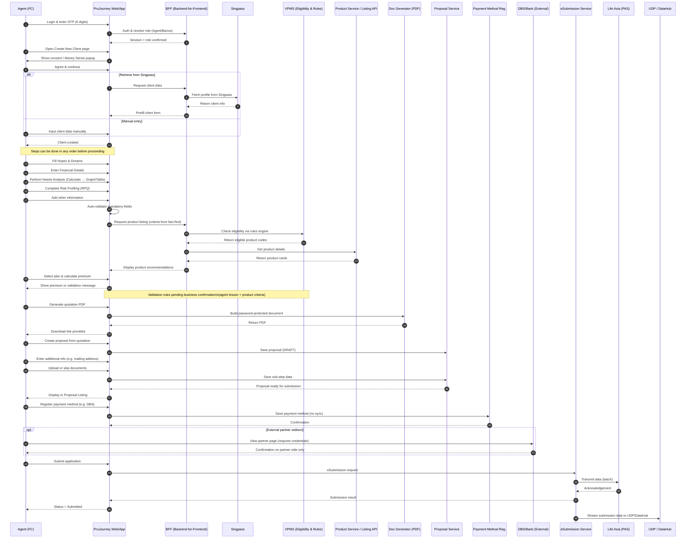

## 🧭 **PruJourney – End-to-End User Journey (Updated)**

### **0. Access & Role**

There are two main user groups:

1. **Prudential Agents (FC / Agency)**
2. **Bankers (Banca)** — working with PruJourney and Prudential.
   Currently, only the Agency flow is available; the Banca journey will be supported later.

---

### **1. Login & OTP**

* The user logs into PruJourney and enters a **6-digit OTP** (for UAT, usually `111111`).
* The system identifies the role (Agent or Banker) and routes the user to the respective workspace.

---

### **2. Landing – “Create New Client”**

* After login, the first screen is **Create New Client**, as required by business.
* Agents can:

  * Retrieve client information via **Singpass**, or
  * Let the client manually fill in the form.
* The user must scroll down, read the consent (“Money Sense”), and click **Agree** before proceeding.

---

### **3. Fact-Find (6 Steps)**

* The fact-find section includes six major steps.
* These steps **don’t have to be completed sequentially**; users can switch between tabs to complete all mandatory data in any order before moving to the next module.

  **Main Steps:**

  1. **Profile / Hopes & Dreams** – Record client goals (e.g., protect wealth, education fund, retirement).
  2. **Financial Details** – Assets, liabilities, income, expenses, budgets, and existing policies.
  3. **Needs Analysis** – Auto-generates categories based on selected Hopes & Dreams. User inputs data and clicks *Calculate* to view charts/tables.
  4. **Risk Profiling (RPQ)** – Questionnaire to assess client’s risk appetite (previously optional, now mandatory in UAT).
  5. **Summary / Review** – Consolidated data view; allows editing before product recommendation.
  6. **Others / Additional Info** – Miscellaneous details or agent notes (if applicable).

> **Note:**
>
> * RPQ, TK result, and Agent’s Training Code are used in **VPMS** for product eligibility filtering.
> * Some products require fund validation (e.g., index-linked plans).

---

### **4. Product Recommendation & Listing**

* Once the Fact-Find steps have sufficient data, the system fetches product lists dynamically via API.
* The agent can **filter, select, and calculate premiums** for eligible products.

**Validation Rules:**

* These depend on both **Agent Lesson Completion** (training eligibility) and **Product Criteria** (from VPMS rules).
* Business confirmation is required since multiple conditions can trigger validation blocks.
  (e.g., missing required lesson, mismatched goal, or incomplete risk profile).

---

### **5. Quotation & Summary**

* Generates a **password-protected PDF** (up to ~22 pages) summarizing all product and plan details.
* If financial details are incomplete, the output is generic.
* Used for client review or offline discussion.

---

### **6. Proposal Creation & Listing**

After confirming the quotation, the agent proceeds to create a **Proposal**.
This includes several **sub-steps** before submission:

1. **Entering Additional Information** – e.g., mailing address, contact details.
2. **Documents Upload** – upload or skip supporting documents (ID, proof of income, etc.).
3. **Review & Confirm** – final check before submission.
4. **Proposal Listing** – displays all proposals (Draft, Submitted, or Pending).

---

### **7. Payment Method Registration**

* The system allows registration of a **payment method** (e.g., DBS).
* This is **not an actual payment**—just registering the chosen method.
* Customers pay externally; there is **no payment status sync API** at this stage.

---

### **8. eSubmission → Life Asia (Core PAS)**

* The final step sends application data to **Life Asia** via the **eSubmission Service** (decoupled from POE).
* Life Asia processes policy data before ingestion into the data lake.
* eSubmission runs as a **batch job (Spring Batch)**, and data is streamed to **UDP/DataHub** for near real-time updates.

---

## 🧩 **Mermaid Sequence Diagram (Updated)**

